<div align = center>

# OKI Fuser Simulation
Program for simulating the fuser unit of an OKI C833 color laser printer for an art project with an Arduino Nano.

[](https://www.gnu.org/licenses/gpl-3.0)
 &nbsp; &nbsp;
[](https://github.com/ArminJo/OKI-Fuser-Simulation/releases/latest)
 &nbsp; &nbsp;
[](https://github.com/ArminJo/OKI-Fuser-Simulation/commits/master)
 &nbsp; &nbsp;
[](https://github.com/ArminJo/OKI-Fuser-Simulation/actions)
 &nbsp; &nbsp;

<br/>
<br/>
[](https://stand-with-ukraine.pp.ua)

</div>

#### If you find this library useful, please give it a star.

&#x1F30E; [Google Translate](https://translate.google.com/translate?sl=en&u=https://github.com/ArminJo/OKI-Fuser-Simulation)

<br/>

# Principle of operation
**The Opto-interrupter must be closed / interrupted manually by a piece inserted in the slot!**

- Analog inputs are initially driven HIGH to simulate cold Fuser thermistors.
- The opto output is driven LOW to simulate an open (unblocked) interrupter.
- When backward motor movement is detected, the opto output is released to simulate a closed (blocked) interrupter.
- When the triac (originally used to switch the fuser heating lamp) is activated:
    • Digital lines are driven HIGH to simulate a hot Fuser.
    • Analog lines are switched back to input mode.
- If no triac activation occurs for 60 seconds, the system resets to the cold Fuser thermistors simulation.

<br/>

# Sample Arduino 1.89 IDE plots
The plots are created with the Arduino 1.x Serial Plotter. The Arduino 2.x Serial Plotter is not as powerful and uses a different data format.

|  |  |
|-|-|
| 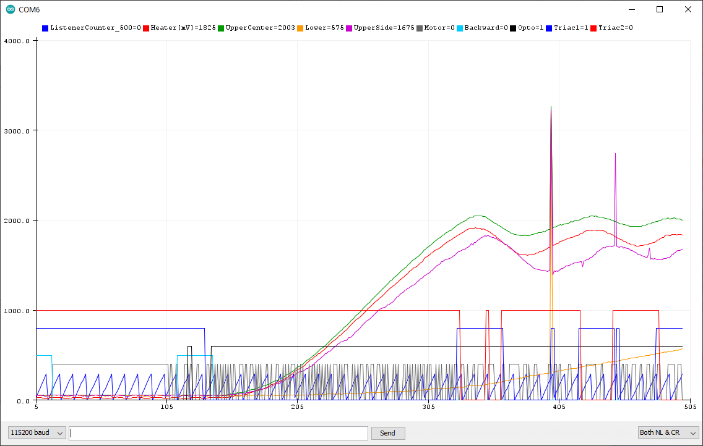 | 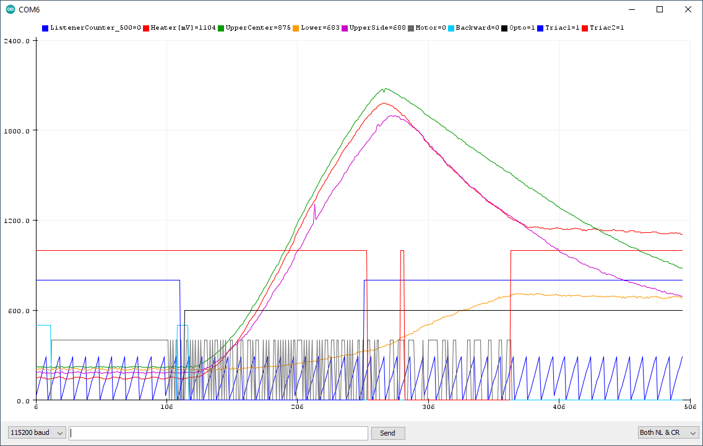 |
| Timing with inserted Fuser | Timing with inserted Fuser |
| | |
| | |
| 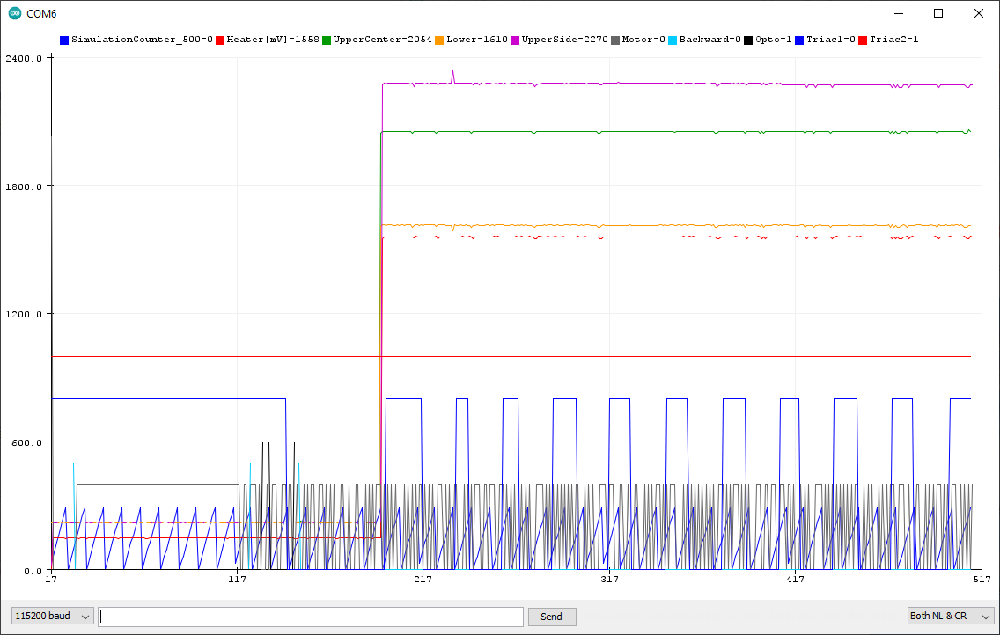 | 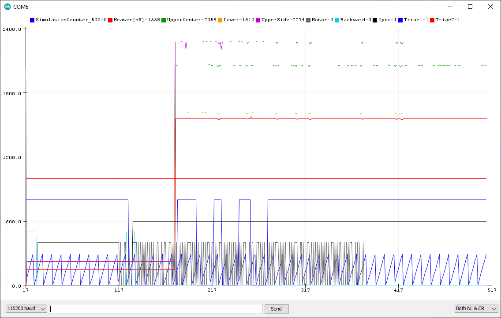 |
| Timing for simulated Fuser | Timing for simulated Fuser |

<br/>

# Compile with the Arduino IDE
Download and extract the repository. In the Arduino IDE open the sketch with File -> Open... and select the OkiFuserSimulation folder.

<br/>

# Pictures

| | | |
|-|-|-|
| 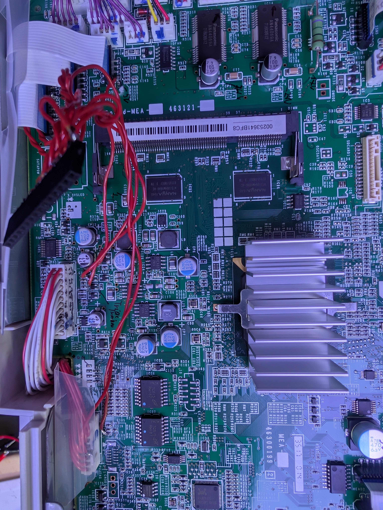 | 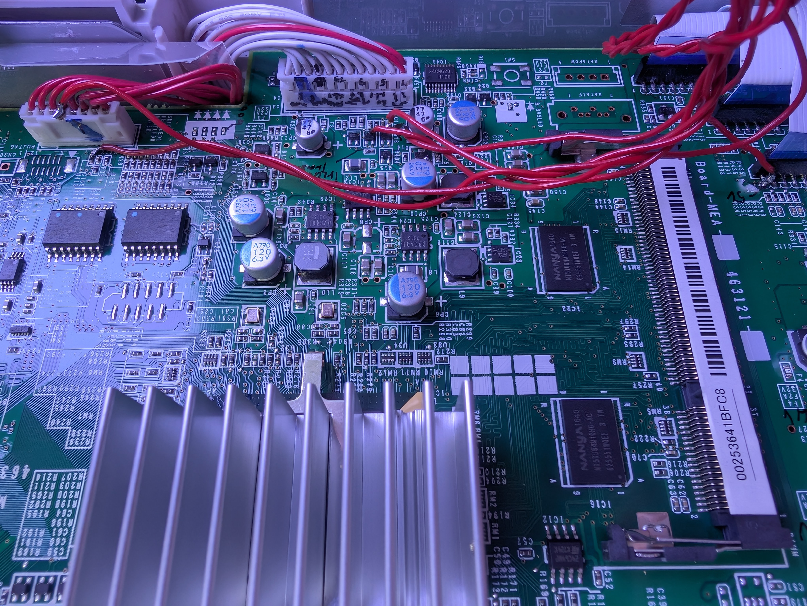 | 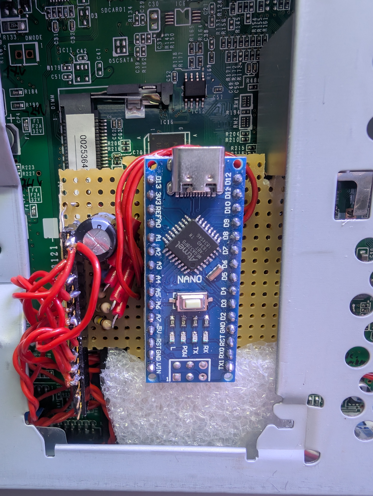 |
| Connections on the CU/PU board: the relay connector is the wide flex cable at the bottom left, and the power connector is the large two-row connector at the bottom center. | Connections on CU/PU board from a different perspective | The Arduino Nano in the OKI |
| | | |
| | | |
| 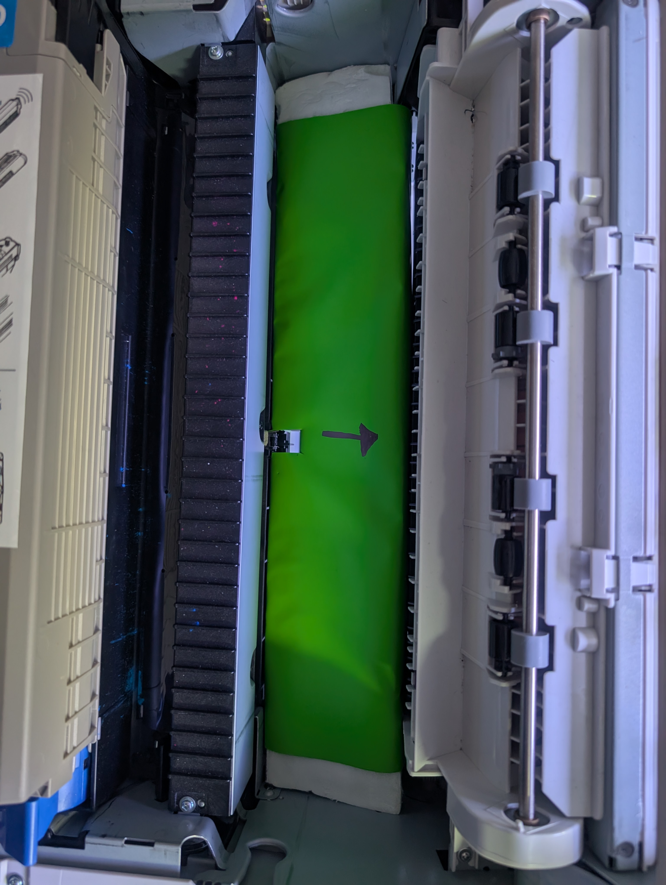 | 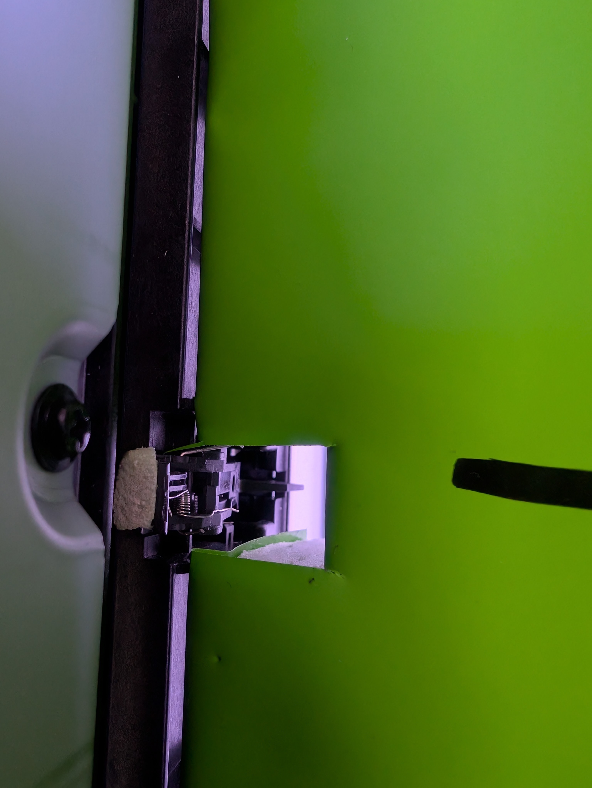 |  |
| The Styrodur ramp coated with a green self adhesive | The slot for the paper jam sensor | Different perspective |
| | | |
| | | |
| 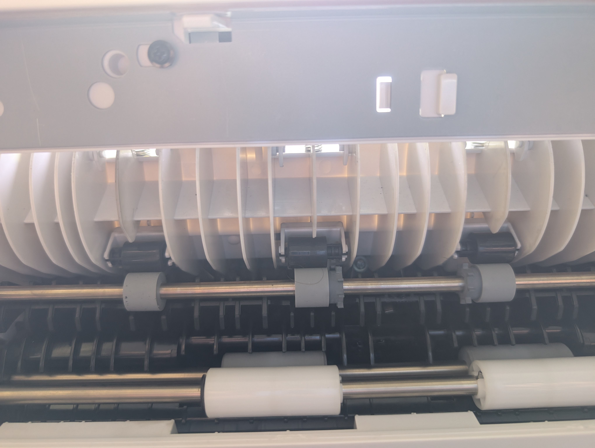 |  | 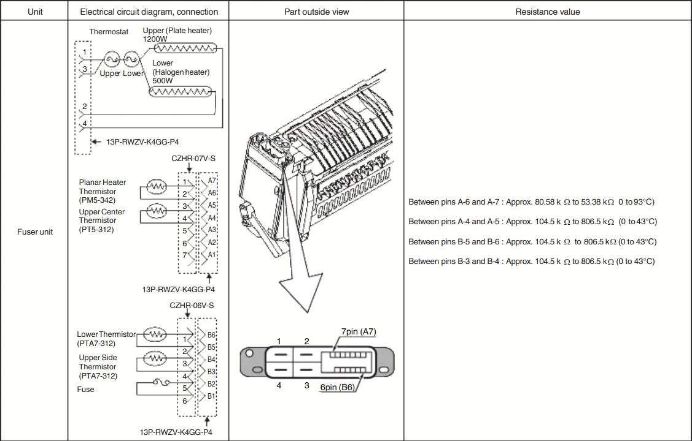 |
| Original pressure rollers, which were removed |  | Fuser connector |

<br/>

# OKI C833 POWER CONNECTOR PINOUT
```
                   ?  2 -   - 1  5V
                  5V  4 -   - 3  5V
        Logic Ground  6 -   - 5  Logic Ground
        Logic Ground  8 -   - 7  Logic Ground
             24 Volt 10 -   - 9  24 Volt
             24 Volt 12 -   - 11 24 Volt
        Power Ground 14 -   - 13 Power Ground
        Power Ground 16 -   - 15 Power Ground
     OptoTriac 1200W 18 -   - 17 10 k Thermistor
VCC for 2 OptoTriacs 20 -   - 19 OptoTriac 500W
       3.4 V Standby 22 -   - 21 Main On Indication
   OptoTriac Main On 24 -   - 23 Power Ground
```

